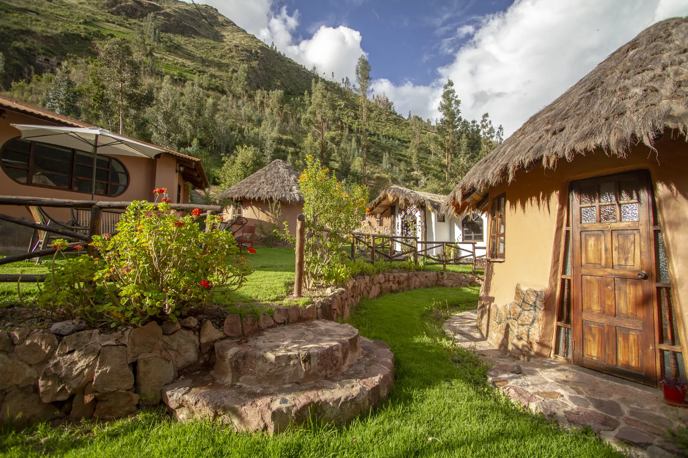

The valley tells you when to work and when to stop. That is not a metaphor. In February the rain closes the road above Calca for days at a time, and in June the nights get cold enough that the kitchen fire matters more than anyone's schedule does.

So these notes follow the valley instead of a content calendar. They go up when there is something worth writing down, and they don't when there isn't.

## Who writes them

People who live and work here. That makes the notes uneven on purpose. A note from the kitchen reads nothing like a note about how a ceremony night is held, because different people wrote them and they know different things.

We would rather publish one honest paragraph from someone who was in the room than a thousand words assembled from somewhere else.

## The five threads

Everything gets filed under one of five:

- [Ceremony](/blog/topic/ceremony), on how a night is held and what it asks of you.
- [The Land](/blog/topic/the-land), on terraces, water, soil and weather.
- [Farm & Food](/blog/topic/farm-and-food), on what the kitchen does with whatever the farm brings in that morning.
- [Retreats & Stays](/blog/topic/retreats), written for people deciding whether to come.
- [Sacred Valley](/blog/topic/sacred-valley), on Calca itself and the people in it.

Each thread has its own page collecting everything filed there. If you only care about one of them, follow that page and skip the rest.

## What we won't do here

No tracking scripts. No popup asking for your email before you've read a sentence. Nothing on this page reports back to anybody, which is the same principle the rest of the project runs on.

> The land sets the schedule. We write down what happened.

There's an [RSS feed](/rss.xml) if you want new notes without checking back. That's the whole subscription mechanism, and it's deliberately the old one.

---

Read a note. Leave. Come back when the next one turns up.
