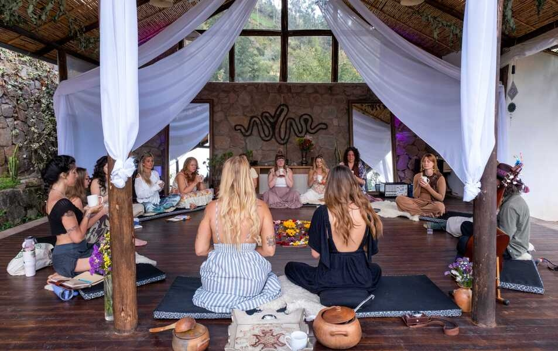

We built Ayni Sanctuary in Calca because this valley already held everything. The mountains, the river, the quiet. What we added was a place to stop.

At a moment when more travellers are choosing to disconnect (from screens, from speed, from routine), the Sacred Valley offers something the cities can't replicate. We're in that valley, in Calca, an hour from Cusco. Not far. Far enough.

## What the place looks like

The sanctuary is a collection of spaces designed to work together. There's a temple for yoga, meditation, and ceremony: a high-ceilinged structure built for stillness. There are rooms and bungalows in different styles, each one prioritising quiet and quality over distraction. And there's the café, shaped like a boat, where people tend to end up at dusk, watching the light leave the mountains with something warm in their hands.

The intention throughout was the same: comfort that doesn't compete with the landscape. Stone, wood, thatch. Materials the valley already knows.

## Retreats and what happens in them

We host international retreats throughout the year. Facilitators bring their own programmes (movement, breathwork, ceremony, silence) and we provide the container: the spaces, the land, the kitchen.

Food is not an afterthought during these gatherings. We bring in chefs who cook from whole ingredients, building menus around what is in season in the valley. A meal becomes part of the experience, not a break from it.

## The valley beyond our gate

Staying at Ayni isn't only about what happens inside. Huchuy Qosqo, the pre-Inca site above the valley, is a morning's walk. Urco, another archaeological site, sits under the Pitusiray mountain, visible from our grounds on a clear day. These places have been here for centuries. They don't ask anything of you except presence.

For those continuing to Machu Picchu, the train station at Ollantaytambo is a short drive. We can help arrange it. But many guests find, by the time they leave, that they've been less interested in moving on than they expected.

## Why we call it Ayni

*Ayni* is a Quechua word. It means reciprocity and interconnectivity: the principle that what you give, the land gives back.

"Ayni means 'reciprocity and interconnectivity' in Quechua, and that is the heartbeat of everything we do. Our purpose is to care for and conserve this singular environment so that, in return, it offers our guests the perfect setting for an absolute reconnection, wrapped in the warmest privacy and comfort," says Joel Virgilio Gonzalez, founder of Ayni Sanctuary.

That's the operating principle. We look after the land. The land looks after the people who come here. It's a simple arrangement. The valley has been running on it for a very long time.

*Ayni Sanctuary is in Calca, Sacred Valley of the Incas, Perú.*
